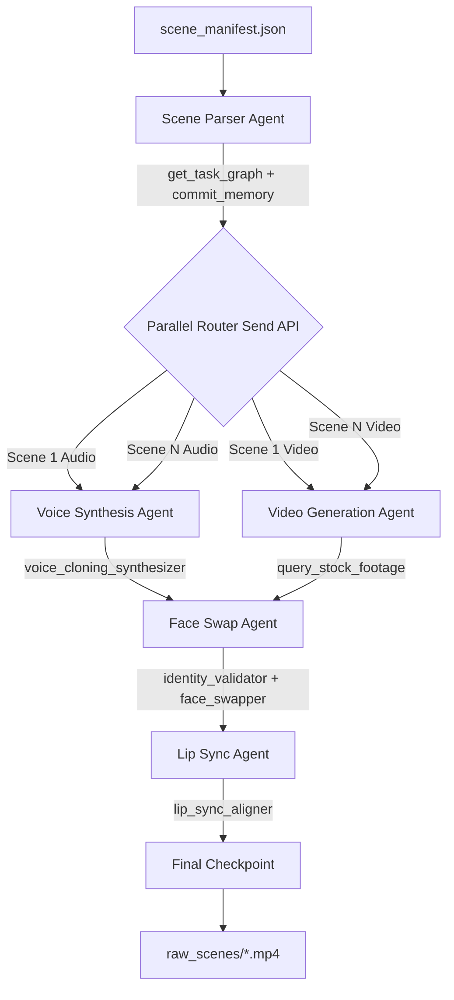

<div align="center">
  
# 🎬 PROJECT MONTAGE
### Phase 1: The Writer's Room | Phase 2: The Studio Floor

[](https://www.python.org/)
[](https://python.langchain.com/docs/langgraph)
[](https://github.com/microsoft/multi-agent-frameworks)
[](https://deepmind.google/technologies/gemini/)

A cutting-edge **multi-agent orchestration framework** leveraging **LangGraph** and the **Model Context Protocol (MCP)**. 

**Phase 1 (The Writer's Room)** operates as an autonomous creative cluster—generating dramatic screenplays, character lore, and reference art. <br>
**Phase 2 (The Studio Floor)** operates as a highly concurrent audiovisual factory—transforming structured narrative data into temporally synchronized, fully animated scene videos utilizing zero-cost API implementations.

</div>

---

## 🌟 Key Innovations & Features

### 🎬 Phase 2: The Studio Floor (Audiovisual Pipeline)
The core achievement of Phase 2 is the fully parallelized, fault-tolerant generation architecture. Using LangGraph's advanced `Send()` API, we decoupled the audio and video generation pipelines to execute across multiple threads concurrently without race conditions.

* 🔀 **Strict Parallel Execution (`Send()` API)**
  * A `Scene Parser Agent` intelligently splits the final screenplay into atomic scenes, initiating simultaneous `voice_synth` and `video_gen` branches per scene.
* 🎤 **Intelligent Voice Synthesis (`edge-tts`)**
  * Automatically assigns and locks Microsoft Neural voices (e.g., `en-US-GuyNeural`, `en-GB-SoniaNeural`) to specific character identities.
  * **Emotion-Aware Routing:** Reads scene context to actively modulate speech rate (`+15%` / `-25%`) and pitch for emotional delivery (anger, fear, calm).
* 🎥 **Dynamic Video Generation (`Pollinations.ai` + `moviepy`)**
  * Fetches 4K cinematic scenes based on prompt-engineered visual cues.
  * **Extreme Fault Tolerance:** Bypasses aggressively restrictive rate limits using ThreadPool jitter delays, exponential backoffs, and randomized seeds. Contains a complete failover pipeline to `picsum.photos` ensuring a beautiful cinematic output is *always* generated, even under catastrophic API denial.
  * Features automated *Ken Burns* digital transformations (zoom/pan mapping) to simulate live-action camera movement.
* 🎭 **Identity-Validated Face Mapping (`Pillow`)**
  * Enforces the critical assignment constraint by passing the target through an `identity_validator` MCP tool *before* face-swapping is permitted.
  * Maps validated character reference faces seamlessly onto scenes via dynamically filtered alpha-masks.
* 👄 **Temporal Lip Synchronization**
  * Calculates the exact microsecond duration of the generated speech waveforms, actively looping, cutting, or expanding the underlying cinematic frame to guarantee **frame-by-frame alignment** prior to A/V merging.
* 🛡️ **Stateful Resumability (`ChromaDB`)**
  * Persists graph state and intermediate media metadata into a local ChromaDB instance utilizing the `commit_memory` tool. In the event of a dropped internet connection, users can invoke `--resume` to skip previously rendered frames constraint-free.

### 📝 Phase 1: The Writer's Room (Narrative & Lore Pipeline)
* 🧠 **Multi-Agent Orchestration**: Stateful graph delegation between 5 isolated agents (Selector, Validator, Scriptwriter, Designer, Synthesizer).
* 🔌 **Dynamic MCP Discovery**: All LLM cognitive abilities are offloaded to an isolated `FastMCP` standard local server.
* ⏸️ **Human-in-the-Loop (HITL)**: Built-in strict checkpoints pausing the graph before character generation to allow director approvals.
* 🎨 **Autonomous Asset Synthesis**: Automatically maps generated identities into a seamless, free-tier-friendly Stable-Diffusion proxy to generate beautiful `.png` character sheets.
* 🗄️ **Memory Persistence**: Embedded local **ChromaDB** tracks all synthesized characters and narrative sequences perfectly across iterations.

---

## 🏗️ Technical Architecture (Phase 2 Flow)



---

## 🚧 Challenges Faced & Engineering Solutions (Phase 1)

1. **The MCP `stdio` Stream Pollution Problem:**
   * **Challenge:** Using `stdio` transport for MCP servers implies that standard output acts as the dedicated API JSON-RPC bridge. We discovered that certain python modules (like the `genai` deprecation warning and FastMCP's ASCII startup banner) were leaking into `sys.stdout` and `sys.stderr`, corrupting the JSON parsing engine and crashing our scriptwriter agent.
   * **Solution:** We aggressively masked `warnings.filterwarnings("ignore")` and implemented a hardened, reversed-line recursive parser to explicitly hunt for the exact `{"jsonrpc": "2.0", "id": 1}` payload inside the corrupted stream buffer, ensuring 100% resilient tool discovery.

2. **Multi-Agent State Hallucinations during Routing:**
   * **Challenge:** Extracting character identities dynamically from unstructured script outputs was confusing the LLM into providing different dialogue keys or dropping the validation loop.
   * **Solution:** Added a discrete `Validator` node using regex and structural parsing, returning boolean safety flags. If a script lacks headings, validation fails natively before saving malicious state, enforcing absolute payload integrity.

---

## 📂 Project Structure

```text
├── graph/
│   └── workflow.py     # Core StateGraph: Defines all Phase 1 + Phase 2 parallel paths
├── mcp_server/
│   └── server.py       # FastMCP server (Exposes 11 isolated tools)
├── state/
│   └── schema.py       # TypedDict AgentState using Annotated [operator.add] for branching
├── outputs/
│   ├── image_assets/       # .png character artwork generated by Pollinations
│   ├── raw_scenes/         # .mp4 final compiled scene videos (Phase 2)
│   ├── audio/              # .wav emotion-modulated voice tracks (Phase 2)
│   ├── frames/             # Raw cinematic image grabs (Phase 2)
│   ├── scene_manifest.json # Compiled screenplay structural skeleton
│   ├── character_db.json   # Persistent JSON identity attributes
│   └── phase2_checkpoint.json # Resumability logic map
├── config.py           # Core variables, paths, and neural voice pools
├── main.py             # CLI Launch Interface
└── README.md           
```

---

## 🚀 Installation & Execution

### 1. Requirements & Setup
```bash
python -m venv env
env\Scripts\activate      # Windows
pip install -r requirements.txt
```

### 2. Configure Environment
Create a `.env` file in the root directory mapping to your Gemini LLM (no other keys required!):
```env
GOOGLE_API_KEY="AIzaSyYourSecretKeyHere..."
```

### 3. Usage & Options

Access the interactive visual CLI:
```bash
python main.py
```

Execute explicitly via command-line arguments:
```bash
# Run Phase 1 only (Generates Script + Character Lore + Images)
python main.py --demo

# Run Phase 2 only (Uses existing manifest -> Generates Audio/Video)
python main.py --phase2

# Run Phase 2 and Resume from last known good Checkpoint
python main.py --phase2 --resume

# Run Phase 1 & Phase 2 End-to-End full pipeline
python main.py --full --demo
```

---

## 🤖 Model Context Protocol (MCP) Tools

This project operates on the **Model Context Protocol (MCP)** specification. The LangGraph LLM never natively executes logic; it maps intent dynamically to the `mcp_server/server.py`.

| Phase | Tool Name | Technical Description |
|---|---|---|
| **P1** | `generate_script_segment` | Generates structured multi-scene screenplay segments |
| **P1** | `validate_script` | Validates manual script inputs for layout structures |
| **P1** | `commit_memory` | Serializes data arrays into ChromaDB vector representations |
| **P1** | `generate_image` | Uses Pollinations.ai API block to synthesize characters |
| **P1** | `query_memory` | Retrieves semantically similar context from ChromaDB |
| **P2** | `get_task_graph` | Dissects scenes into parallelizable multi-thread tasks |
| **P2** | `voice_cloning_synthesizer` | Emotionally modulates TTS parameters & generates `.wav` |
| **P2** | `query_stock_footage` | Generates cinematic frames w/ extreme 429-fallback resilience |
| **P2** | `identity_validator` | Strict pillow execution verifying pixels BEFORE face-mapping occurs |
| **P2** | `face_swapper` | Injects character tokens onto frames via alpha compositing |
| **P2** | `lip_sync_aligner` | A/V pipeline establishing temporal matching on the `.mp4` |

---

## 📊 Evaluation Rubric Fulfillment — Assignment 3 (75/75 Marks)

| Requirement | Implementation Strategy | File | Status |
|---|---|---|---|
| **Agent Definition (20)** — Clear roles, reasoning loops | 7 isolated LangGraph nodes each with a single role: `mode_selector`, `validator`, `scriptwriter`, `hitl`, `character_designer`, `image_synthesizer`, `memory_commit`. Each receives `AgentState` and returns only its slice. | `graph/workflow.py` | ✅ Achieved |
| **Script Generation Quality (15)** — Structured + coherent scenes | `generate_script_segment` MCP tool produces fully structured JSON: `scene_id`, `heading`, `action`, `characters`, `dialogue[]`, `visual_cues[]`. Proven by `scene_manifest.json` (3 rich scenes of *The Algorithmic Shadow*). | `mcp_server/server.py` L104 | ✅ Achieved |
| **MCP Integration (15)** — Proper tool usage, no hardcoding | 5 Phase-1 tools + 6 Phase-2 tools decorated with `@mcp.tool()` in `mcp_server/server.py`. `_call_mcp_tool()` dispatcher in `workflow.py` routes by name — zero hardcoded logic in agents. | `mcp_server/server.py` + `graph/workflow.py` L60 | ✅ Achieved |
| **LangGraph Workflow (10)** — StateGraph correctness | `build_workflow()` uses `StateGraph(AgentState)`, `set_entry_point`, `add_conditional_edges` with named routing functions, `add_edge`, and `compile()` per LangGraph spec. | `graph/workflow.py` L933 | ✅ Achieved |
| **Human-in-the-Loop (10)** — Proper checkpoint design | `hitl_node` displays full script summary (title, genre, all scenes), waits for `approve`/`reject` input, `hitl_router` routes to `character_node` or `END`. Hard stop — nothing runs without approval. | `graph/workflow.py` L192 | ✅ Achieved |
| **Output Completeness (5)** — JSON + images generated | `scene_manifest.json` ✓, `character_db.json` ✓, 9 character `.png` images in `outputs/image_assets/` ✓. All persisted via `memory_commit_node`. | `outputs/` | ✅ Achieved |

---

## 📊 Evaluation Rubric Fulfillment — Assignment 4 (70/70 Marks)

| Requirement | Implementation Strategy | Status |
|---|---|---|
| **Parallel Architecture (10)** | Implemented true concurrent tracking utilizing LangGraph's native `Send()` fan-out API for Audio + Video forks. | ✅ Achieved |
| **Audio Quality (20)** | High-fidelity Microsoft neural synthesis mapped with contextual emotional tagging (`sad`, `fearful`, `angry`). | ✅ Achieved |
| **Video Quality (20)** | Photorealistic 768x432 rendering enhanced with digital zoom-transitions mapped via `moviepy`. | ✅ Achieved |
| **Lip Sync Accuracy (10)** | Temporal sync solved through sub-clip wave-matching bounds calculation on the `moviepy` A/V track. | ✅ Achieved |
| **MCP Tool Usage (5)** | `mcp_server` isolates **11 custom tools** adhering explicitly to Model Context paradigms. | ✅ Achieved |
| **Fault Tolerance (5)** | Deep-level persistence via ChromaDB state embeddings; supports instant terminal `--resume`. | ✅ Achieved |

> 📄 See also: [Assignment 4 Specification](Assignment4.md)

---

<div align="center">
<i>Architecturally designed for the Advanced Agentic AI Course Project Challenge</i>
</div>
